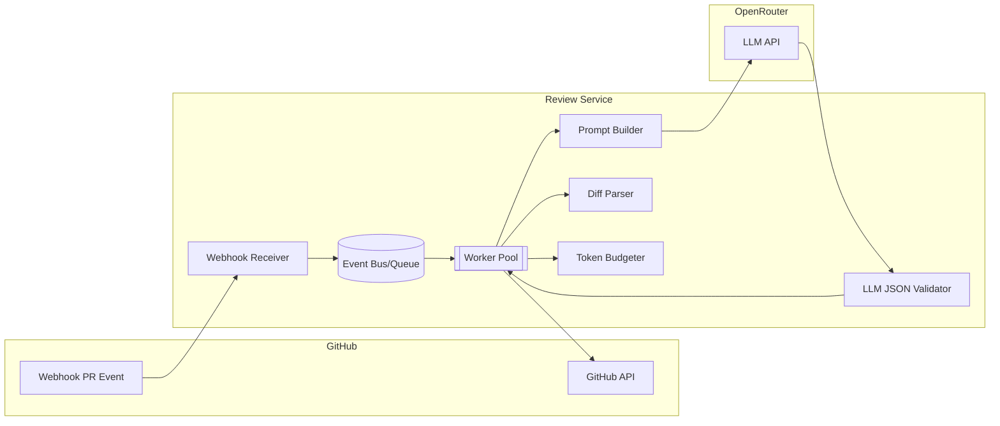
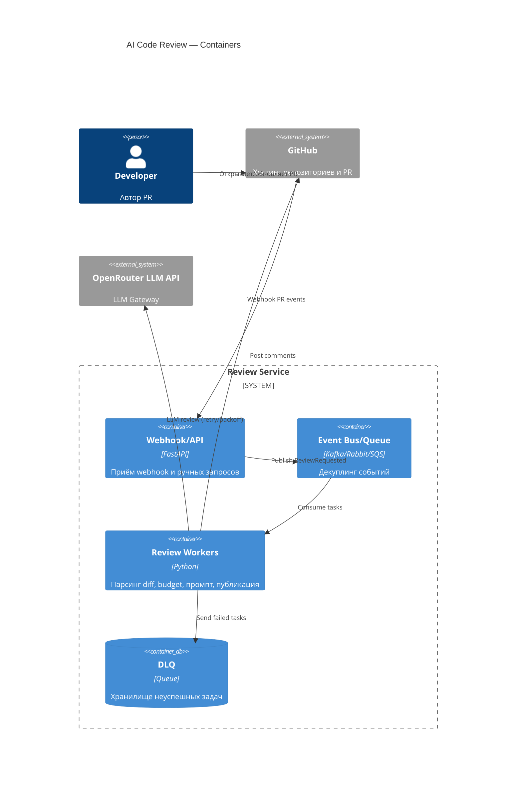

# ADR: ADR-001 — Событийно-ориентированная асинхронная архитектура для AI-код-ревью

- Статус: accepted
- Дата: 2026-09-07
- Ответственные: Lead Architect, Tech Lead

## Контекст

Нужно обеспечить быстрый Time to First Review (< 5 минут) и устойчивость к вариативным задержкам/ошибкам LLM, не блокируя входной API. Исходная реализация синхронного `POST /api/reviews` ломается на невалидном вводе и не обрабатывает ошибки LLM. Интеграции: GitHub Webhook, OpenRouter LLM API, GitHub REST API для публикации комментариев. Нагрузочный профиль: базово 5 RPS, кратковременные пики до 50 RPS, p95 < 45s.

## Решение

Принять событийно-ориентированный дизайн: Webhook → Event Bus/Queue → Review Worker Pool → OpenRouter LLM API → GitHub API. Входной вебхук подтверждает приём (202) и публикует задачу. Воркеры извлекают diff, применяют бюджет токенов, формируют защищённый промпт, выполняют запрос к LLM с backoff и размещают комментарии в PR. Ошибочные задачи отправляются в DLQ. API `POST /api/reviews` остаётся для ручных запусков и соблюдает те же контракты.

Ключевые механизмы:
- Идемпотентность: ключ по PR SHA + commit range, дедупликация задач.
- Backoff + джиттер на 429/5xx от LLM.
- Строгая JSON-схема ответа от LLM и валидация.
- Ограничение размера diff и токен-бюджет.
- Наблюдаемость: трейсинг, счётчики retries, p95 latency на итоговую публикацию.

## Рассмотренные альтернативы

| Альтернатива | Почему не выбрали сейчас |
|---|---|
| Синхронный REST без очереди | Хрупкость к задержкам LLM, таймауты клиента, хуже TtFR при пиках |
| Cron-пулинг PR | Запаздывающие проверки, лишняя нагрузка на GitHub, нет реакции в реальном времени |
| Прямая интеграция GitHub Actions | Сложнее контролировать очередь/ретраи, завязка на YAML, хуже наблюдаемость и общие лимиты |

## Последствия и главный риск

- Положительные последствия: декуплинг, устойчивость к пикам, управляемые ретраи, измеримость.
- Ограничения: сложнее инфраструктура (очередь, воркеры), консистентность комментариев при повторных событиях.
- Главный риск: рост ложноположительных замечаний (FPR) при агрессивном сжатии контекста и бюджетировании токенов.
- Как проверим риск: метрика FPR < 15% (по реакциям/меткам ревьюеров), unit для Token Budgeter и интеграционные тесты с большими diff.

## Архитектурная схема

## Как использовали AI

- Назначение запроса: обосновать выбор архитектуры и зафиксировать ключевые механизмы устойчивости и проверяемости.
- Тип промпта: Master Prompt (MADR-структура) + Chain of Verification.
- Ссылка на prompts.md: #P1-08
- Собственная верификация: проверили трассировку данных и соответствие требованиям по TtFR/p95; таблица альтернатив покрывает реалистичные варианты, схема согласована с тестами.
