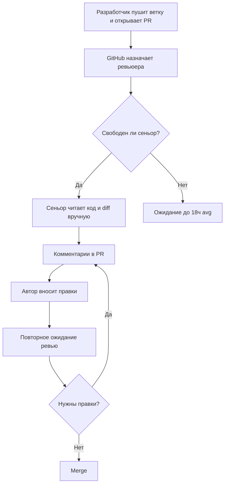
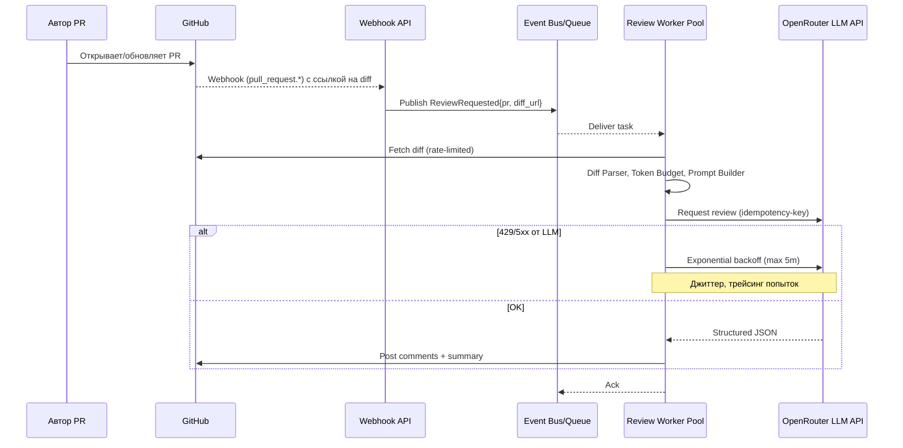

# Анализ процесса: AS IS и TO BE

## AS IS

Ручной процесс ревью в команде из 30 инженеров (5 сеньоров):

Проблемы: высокая задержка до первого отзыва, непостоянное качество комментариев, много циклов «мелких фиксов», отсутствие автоматических проверок на типовые проблемы.

## TO BE

Добавляем авто-ревью бота, работающего от вебхука и очереди. Диаграмма последовательностей для одного PR:

Важные элементы: триггер — GitHub Webhook; декуплинг через очередь; защита от падений LLM — backoff и graceful degradation (сводка-«извинение» без блокировки пайплайна).

## Разница

| Что меняется | AS IS | TO BE | Как проверим изменение |
|---|---|---|---|
| Триггер ревью | Ручное назначение ревьюера | Авто-триггер по Webhook | Интеграционный тест: эмуляция Webhook → публикация комментария |
| Время на первый отзыв | ~18 часов | < 5 минут | Метрика TtFR из GitHub Events |
| Обработка больших diff | Нет ограничений | Отсечение > 64 KiB, чанки | Тест с большим diff (ожидаемый 413/422 или частичная обработка) |
| Отказоустойчивость LLM | Нет | Backoff + fallback | Тесты 429/500 с ожиданием повторов |
| Структура ответа | Текст без схемы | JSON-схема + маппинг в комментарии | Контрактные тесты схемы |

## Graceful degradation

Если LLM недоступен или превышен лимит, система:
- ставит задачу в повтор с экспоненциальной паузой (до N попыток),
- при исчерпании попыток публикует один комментарий с кратким статусом и ссылкой на ретрай позже,
- никогда не возвращает 5xx клиенту из-за внутренних ошибок LLM в синхронном API; для асинхронного пути — ack задачи и запись в DLQ.

## Как использовали AI

- Назначение запроса: сравнить AS IS и TO BE, зафиксировать точки интеграции и поведение при сбоях LLM.
- Тип промпта: Master Prompt с Chain of Verification.
- Ссылка на prompts.md: #P1-05
- Собственная верификация: проверили соответствие TO BE архитектуре в adr.md и тестам (integration/load/e2e); уточнили, что именно является триггером и как проявляется деградация.
