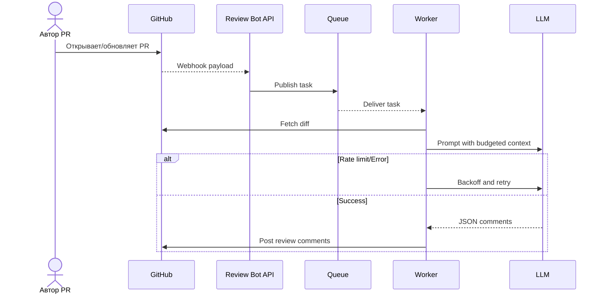

# Use cases и user stories

## Первый рабочий сценарий

Когда автор открывает или обновляет PR, система автоматически инициирует AI-код-ревью и публикует первые комментарии в течение минут, а пользователь получает структурированный список замечаний с ссылками на строки и краткую сводку. При сбое LLM пользователь получает информативный комментарий о задержке без блокировки процесса.

Не входит в этот сценарий:

- Авторизация/платёжные ограничения, долгосрочное хранение чатов, авто-фиксы кода.

## Use Case 1: Авто-ревью PR

| Поле | Значение |
|---|---|
| Актор | Автор PR (Developer) |
| Триггер | Webhook `pull_request.opened/synchronize` или ручной `POST /api/reviews` |
| Предусловия | Репозиторий подключён к GitHub App, настроены секреты OpenRouter/GitHub |
| Основной результат | Комментарии к строкам diff + сводка в PR в течение < 5 минут |
| Ошибка или отказ | При 429/5xx у LLM — отложенная публикация с backoff, при превышении лимита — краткий комментарий о невозможности анализа |



## Use Case 2: Интерактивный тред в PR

| Поле | Значение |
|---|---|
| Актор | Автор PR, Ревьюер |
| Триггер | Команда в комментарии `@review-bot explain <id>` |
| Предусловия | Уже опубликованы авто-замечания с идентификаторами |
| Основной результат | Бот публикует развёрнутое объяснение/пример исправления |
| Ошибка или отказ | При превышении контекста — сжатый ответ со ссылкой на документацию |

## Use Case 3: Аудит безопасности изменений

| Поле | Значение |
|---|---|
| Актор | Security Champion, Team Lead |
| Триггер | Лейбл `security-review` на PR |
| Предусловия | Подключён профиль промпта безопасности |
| Основной результат | Отдельная сводка по рискам (инъекции, секреты, уязвимые паттерны) |
| Ошибка или отказ | Если дифф слишком велик, анализируется только high-risk файлы/паттерны |

## User stories и acceptance criteria

```gherkin
Feature: Автоматическое AI-код-ревью PR

  Scenario: Первый отзыв в пределах 5 минут
    Given открыт PR с валидным diff до 64 KiB
    When GitHub отправляет webhook и воркер обрабатывает задачу
    Then бот публикует хотя бы один комментарий и сводку в PR в течение 5 минут

  Scenario: Обработка отсутствующего поля diff
    Given клиент отправляет POST /api/reviews без поля diff
    When API валидирует запрос
    Then клиент получает 422 Unprocessable Entity без 5xx

  Scenario: Ограничение размера diff
    Given клиент отправляет POST /api/reviews с diff более 64 KiB
    When API валидирует запрос
    Then клиент получает 413 Payload Too Large или 422 с сообщением о лимите

  Scenario: Rate limit от LLM
    Given LLM возвращает 429 на первый запрос
    When воркер применяет экспоненциальный backoff с джиттером
    Then он делает повторные попытки до конфигурируемого предела и в случае истечения лимита публикует информативный комментарий

  Scenario: Структура ответа
    Given воркер получил JSON от LLM
    When структура соответствует схеме comments[{file,line?,text}], summary
    Then бот публикует комментарии по строкам и сводку без ошибок парсинга
```

## Как использовали AI

- Назначение запроса: сформировать use cases и проверяемые acceptance criteria, согласованные с архитектурой и метриками.
- Тип промпта: Master Prompt с Given-When-Then шаблоном.
- Ссылка на prompts.md: #P1-06
- Собственная верификация: связали сценарии с тестами (unit/integration/load/e2e) и ограничениями контекста; исключили нефункциональные пожелания без метрик.
