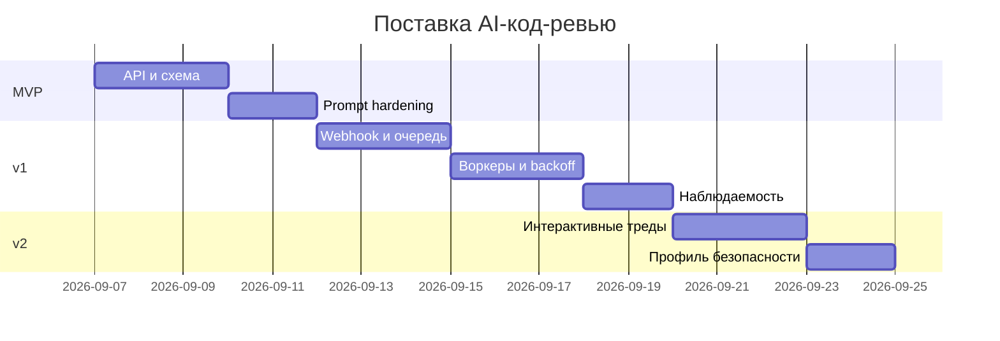

# План поставки

## Фазы (MVP → v1 → v2)

- MVP: синхронный `POST /api/reviews` с валидацией, лимитом размера diff, безопасным промптом и структурированным ответом. Публикация комментариев вручную через CLI или dry-run.
- v1: Webhook-интеграция с GitHub, очередь задач и пул воркеров, ретраи 429/5xx, публикация комментариев ботом, наблюдаемость (логи/метрики/трейсинг).
- v2: Интерактивные треды, профиль безопасности, адаптивный токен-бюджет и эвристики выделения high-risk изменений, DLQ и консоль ретраев.

## Инкременты и ответственность (RACI включает AI-агента)

| Инкремент | Наблюдаемый результат | R (Responsible) | A (Accountable) | C (Consulted) | I (Informed) |
|---|---|---|---|---|---|
| MVP-API | Валидация, лимит 64 KiB, JSON-ответ | Backend Eng | Tech Lead | Sec, DevEx | Команда |
| MVP-Prompt | Prompt hardening, JSON schema | AI Agent | Tech Lead | Backend Eng | Команда |
| v1-Webhook | Приём Webhook, публикация в очередь | Platform Eng | Tech Lead | Backend Eng | Команда |
| v1-Workers | Пул воркеров, backoff | Backend Eng | Tech Lead | AI Agent | Команда |
| v1-Observability | Логи/метрики/трейсинг | SRE | Tech Lead | Backend Eng | Команда |
| v2-Interactive | Команды в треде, explain | Backend Eng | Tech Lead | AI Agent | Команда |
| v2-SecurityProfile | Отдельный профиль безопасности | Sec | Tech Lead | Backend Eng | Команда |

## RACI по ролям (включая AI-агента)

- Backend Engineer: R по API/воркерам, C по промптам.
- Platform Engineer: R по Webhook/очереди.
- SRE: R по наблюдаемости и SLO.
- Security: C по политике данных и профилю безопасности.
- Tech Lead: A по релизам и приёмке.
- AI-агент: R за подготовку и проверку промптов, C в ревью схем и тестов.

## Управление рисками

- Rate limits: экспоненциальный backoff с джиттером, агрегирование запросов, кэширование контекста, идемпотентность по ключам задач.
- Context window: токен-бюджет, агрессивное сжатие diff, выделение high-risk файлов, отсечение нерелевантных хунков.
- Hallucinations: строгая JSON-схема, валидация и отбраковка, короткие утверждения с evidence, ограничение полномочий модели.
- ОOM воркеров: лимиты размера задачи, потоковая обработка, разбиение на чанки, контроль памяти.

## Диаграмма Ганта

## Как использовали AI

- Назначение запроса: спланировать поставку по фазам, роли и риски, выровнять с архитектурой и тестами.
- Тип промпта: Master Prompt для проектирования проектов (RACI/risks/Gantt).
- Ссылка на prompts.md: #P1-07
- Собственная верификация: проверили, что каждый риск закрывается конкретной мерой и тестом; RACI не содержит конфликтов; фазы логически выстроены.
